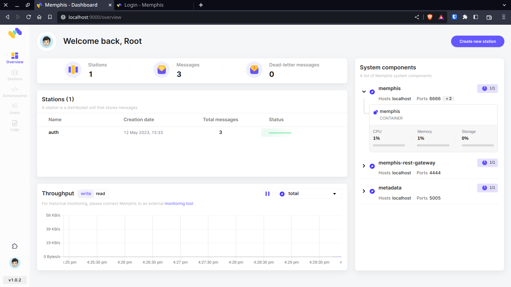

EventSpot

# Tech Stack
1. Go
2. Redis
3. Memphis
4. MongoDB
5. Docker

```bash
docker-compose up 
```

## Setup guide for the project:
1. Clone the repository from GitHub.
2. If you want to work with a specific service, such as the authentication or mail service, you need to navigate to the directory of that service and create a `.env` file with the necessary environment variables.
3. Copy the required variables from the `.env.dev` file and add them with value to a new .env file in the directory of the service.
4. Open a terminal window and navigate to the root directory where the `memphis.yaml` and `database.yaml` files are located.
5. Run the following command to start the database and Memphis services:
```bash
docker-compose -f memphis.yaml -f database.yaml up -d
```
6. Once the services have started, navigate to the Memphis dashboard by opening a web browser and going to `localhost:9000`.Log in to the Memphis dashboard using the default username and password: **`root`** and **`memphis`**.
From the Memphis dashboard, you can create new events, topics, and subscriptions to handle messages between services.



7. To start using the Memphis service with the services you have configured, you will need to run the corresponding service in its directory. For example, to use the authentication service, navigate to the auth directory and run the following command:
```go
go run cmd/main.go
```
That's it! 
